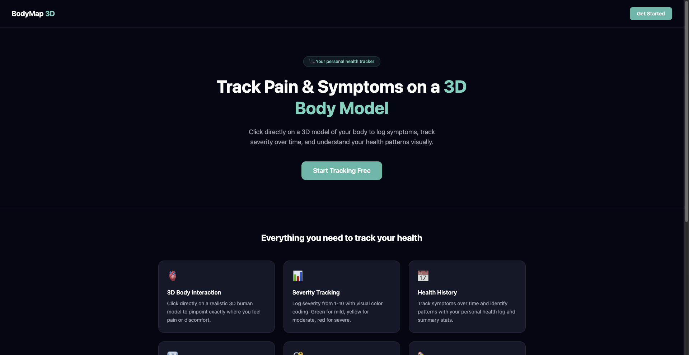
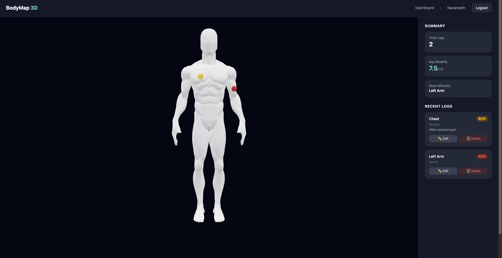
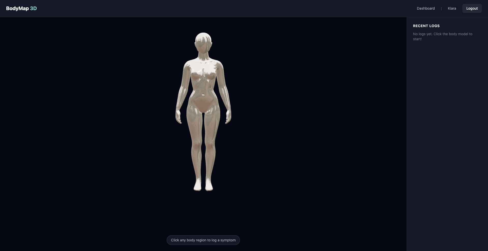
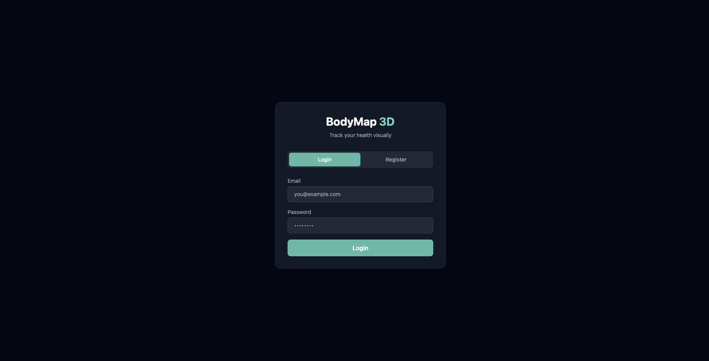
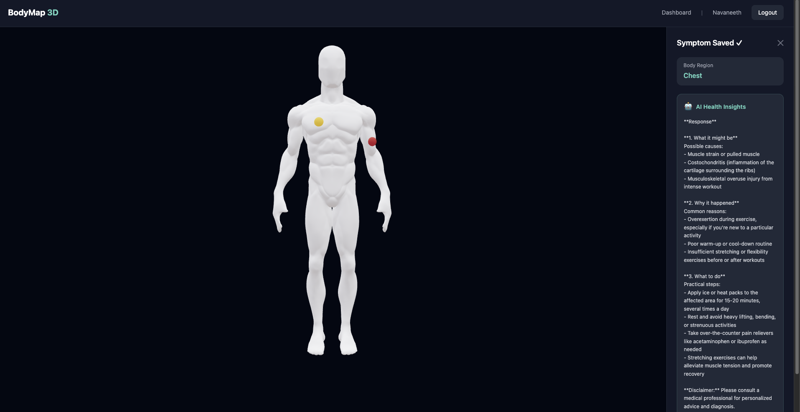

# BodyMap 3D 🩺


> An interactive 3D health symptom tracker — click directly on a human body model to log pain, track severity, and get AI-powered health insights.



---

## 📸 Screenshots

### Dashboard — 3D Body Model



### Login & Register


### AI Insight


---

## ✨ Features

- 🫀 **Interactive 3D Body Model** — Click any region on a realistic male/female 3D model to log symptoms
- 🎯 **Front & Back Detection** — Raycasting detects exact body region on both front and back of the model
- 🔴 **Severity Color Markers** — Pain markers color-coded by severity (green → mild, yellow → moderate, red → severe)
- 🤖 **AI Health Insights** — Locally hosted LLaMA 3.2 via Ollama suggests possible causes and next steps
- 📊 **Analytics Dashboard** — Summary cards showing total logs, average severity, and most affected region
- ✏️ **Edit & Delete Logs** — Full control over your symptom history
- ⚧ **Male & Female Models** — Choose anatomically accurate body model during registration
- 🔐 **Secure Auth** — JWT-based authentication with bcrypt password hashing

---

## 🛠 Tech Stack

### Frontend
| Technology | Purpose |
|---|---|
| React + Vite | UI framework and build tool |
| Three.js + React Three Fiber | 3D body model rendering and interaction |
| Tailwind CSS | Styling |
| React Router | Client-side navigation |
| Axios | HTTP client with JWT interceptor |

### Backend
| Technology | Purpose |
|---|---|
| Node.js + Express | REST API server |
| MongoDB + Mongoose | Database and ODM |
| JWT + bcrypt | Authentication and password hashing |
| Ollama + LLaMA 3.2 | Local AI model for health insights |

---

## 🚀 Getting Started

### Prerequisites
- Node.js v18+
- MongoDB Atlas account
- Ollama installed (`brew install ollama`)
- LLaMA 3.2 model (`ollama pull llama3.2`)

### 1. Clone the repo
```bash
git clone https://github.com/NavaneethMaruthi/Body-Map.git
cd Body-Map
```

### 2. Setup the backend
```bash
cd server
npm install
```

Create `server/.env`:
```
PORT=5001
MONGO_URI=your_mongodb_connection_string
JWT_SECRET=your_jwt_secret
```

Start the server:
```bash
npm run dev
```

### 3. Setup the frontend
```bash
cd client
npm install
npm run dev
```

### 4. Start Ollama (for AI insights)
```bash
ollama serve
```

### 5. Open the app
```
http://localhost:5173
```

---

## 📁 Project Structure

```
Body-Map/
├── client/                  # React + Three.js frontend
│   ├── src/
│   │   ├── components/
│   │   │   ├── BodyModel.jsx      # Three.js 3D scene + raycasting
│   │   │   ├── SymptomPanel.jsx   # Log form + AI insights
│   │   │   ├── EditModal.jsx      # Edit existing logs
│   │   │   └── Navbar.jsx
│   │   ├── pages/
│   │   │   ├── Home.jsx           # Landing page
│   │   │   ├── Dashboard.jsx      # Main app page
│   │   │   └── Login.jsx          # Auth page
│   │   ├── context/
│   │   │   └── AuthContext.jsx    # Global auth state
│   │   └── api/
│   │       └── axios.js           # Axios instance + interceptor
│   └── public/
│       └── models/                # GLTF body models
│           ├── male.glb
│           └── female.glb
│
└── server/                  # Node.js + Express backend
    ├── controllers/
    │   ├── authController.js
    │   └── symptomController.js
    ├── models/
    │   ├── User.js
    │   └── SymptomLog.js
    ├── routes/
    │   ├── auth.js
    │   ├── symptoms.js
    │   └── insights.js
    ├── middleware/
    │   └── authMiddleware.js
    └── config/
        └── db.js
```

---

## 🔌 API Endpoints

### Auth
| Method | Endpoint | Description |
|---|---|---|
| POST | `/api/auth/register` | Register with name, email, password, gender |
| POST | `/api/auth/login` | Login and receive JWT token |

### Symptoms
| Method | Endpoint | Description |
|---|---|---|
| GET | `/api/symptoms` | Get all logs for logged-in user |
| POST | `/api/symptoms` | Create a new symptom log |
| PUT | `/api/symptoms/:id` | Update an existing log |
| DELETE | `/api/symptoms/:id` | Delete a log |
| GET | `/api/symptoms/summary` | Get aggregated analytics |

### AI Insights
| Method | Endpoint | Description |
|---|---|---|
| POST | `/api/insights` | Get AI health insights for a symptom |

---

## 🧠 How the 3D Interaction Works

1. A GLTF human body model is loaded using `@react-three/drei`'s `useGLTF` hook
2. React Three Fiber's `onClick` event gives us the exact 3D click coordinates (`point.x`, `point.y`, `point.z`)
3. The `z` coordinate determines front vs back of the body
4. `x` and `y` coordinates map to specific body regions via a coordinate range function
5. A glowing sphere marker is placed at the exact click point
6. Markers are color-coded: 🟢 severity 1-3, 🟡 severity 4-6, 🔴 severity 7-10

---

## 📝 Resume Points

- Built a full-stack health tracking web app using React, Three.js, Node.js, and MongoDB, featuring an interactive 3D human body model where users click to log symptoms, with JWT authentication, real-time severity visualization, and AI-powered health insights via a locally hosted LLaMA 3.2 model.

- Developed an interactive 3D medical symptom tracker using React and Three.js with raycasting-based body region detection across front and back anatomy, dynamic pain markers color-coded by severity, and a responsive dashboard with real-time health analytics.

---

## 👨‍💻 Author

**Navaneeth Maruthi**
- GitHub: [@NavaneethMaruthi](https://github.com/NavaneethMaruthi)

---

## ⚠️ Disclaimer

BodyMap 3D is not a medical device. AI insights are generated by a local LLM and are not medical advice. Always consult a healthcare professional for proper diagnosis and treatment.

## License
MIT 